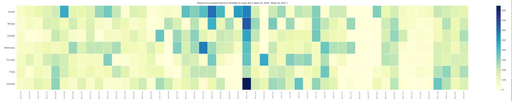

# fviz



Facebook Data Visualizer - made with &lt;3

**Released v0.7.0 on PyPI**

## vision

I was interested in understanding my facebook activity i.e. 

- How much time I'm spending on facebook
- Which quarter of day I'm mostly active on facebook
- Which are those profiles, I'm mostly interacting with
- What's my facebook friending rate
- How has my facebook browsing behaviour changed overtime etc.

Also I had a knack in checking how much data I'm giving to facebook. So, I thought of analysing exported facebook data and understanding what it is saying. 

Later on I thought of making this tool a portable and easy installable one. So that anyone with some simple installation skills can use this tool and generate several plots, and understand their own facebook activity.

This tool does strictly run on user's machine. It doesn't talk to any remote machine, so you can use it safely by feeding it your exported facebook data.

## installation

**fviz** can be installed using pip. Also make sure you've Python ( >=3.7 ).

```bash
$ python3 -m pip install fviz -U
```

_Note: Add your default pip installation location to system **PATH** variable, so that you can invoke **fviz** from anywhere in system._

## data

You can download your copy of facebook data as **JSON**, by following these [instructions](https://www.facebook.com/help/212802592074644).

_Note: **fviz** only supports JSON data format._

## usage

`sink` is the directory where this *.zip* to be extracted. And `plots` is the directory where generated plots to be placed. You can set them as you will.

```bash
$ fviz facebook-userid.zip sink plots
```

## features

All these plots to be generated when you invoke *fviz* with proper params.

- Likes and Reactions
    - [Facebook Likes & Reactions by You](./docs/reactionsByYou.md)
    - [Top 10 Facebook profiles, whose posts were mostly reacted by You](./docs/top10ProfilesWithMostlyReactedPostsByYou.md)
    - [Detailed Facebook Likes & Reactions HeatMap](./docs/detailedReactionsHeatMap.md)
    - [Weekly Accumulated Facebook Likes & Reactions HeatMap](./docs/weeklyAccumulatedReactionsHeatMap.md)
    - [Top 3 Facebook profiles, whose posts were mostly liked & reacted by YOU, _per month_](./docs/top3ProfilesWithMonthlyMostReactedPosts.md)
    - [Accumulated Facebook likes and reactions mapped onto each minute of a Day](./docs/accumulatedAcivityInEachMinuteOfDay.md)

- Friends
    - [Monthly Facebook Friends Created by YOU](./docs/monthlyFriendingRate.md)

- Comments
    - [Top 10 Facebook Profiles, with whom YOU mostly interacted in Facebook Comments](./docs/top10ProfilesWithMostlyCommentedPostsByYou.md)

- Misc
    - [Facebook Activity on each Quarter of Day](./docs/facebookActivityOnEachQuarterOfDay.md)


**This section will keep getting populated !!!**
