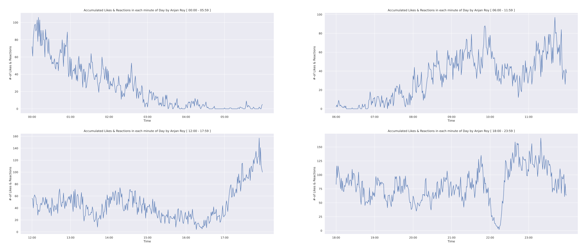

# Accumulated Facebook likes and reactions mapped onto each minute of a Day

## purpose

I was interested in exploring at which minute/ hour of day I'm spending most of my time on Facebook, so I thought of mapping all likes and reactions onto each minute of day _( there's 1440 minutes in a day )_ and finally plotted them as a line plot. For ease of understanding I've also splitted 24 hours lengthy day into 4 eqaul parts, where each of 6 hours lengthy span is plotted in a subplot.

## example

Below is an example plot of this kind, where time is plotted along X-axis and #-of likes and reactions are plotted along Y-axis.

