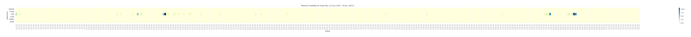
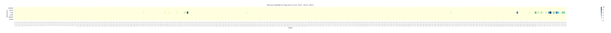
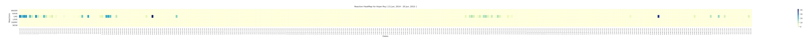
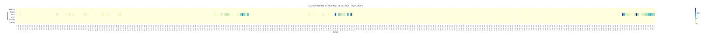
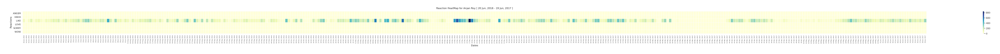
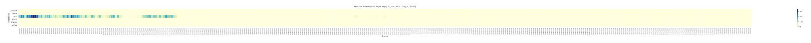
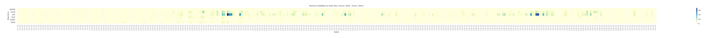
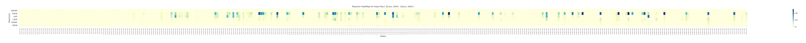

# Detailed Facebook Likes & Reactions HeatMap

## purpose

Given likes and reactions data of any facebook user, we'll group it by day of occurance. And under each day record, we'll also keep seperate count for each of reaction categories i.e. HAHA, LIKE, WOW etc. 

This data to be plotted as a heatmap where along X-axis we keep days _( each day in between dataset time frame )_ and along Y-axis we're keeping reaction types. Each cell of heatmap will hold count of reactions in that certain category on that certain date. 

This will be helpful in understanding 

- User activity over time
- How did it change ?
- What kind of reaction type does user prefer mostly ?
- How did this preference change over time ?

Giving an insight into their facebook activity 

## example 

As we're plotting each day of time frame along X-axis, we're going to be splitting it into 365 day spans. And each of these spans to be plotted in a subplot. The data I used for generating these plots is 8-years of facebook activity. So, 8 different plots. I could've placed them all in one figure too, didn't do so intentionally cause that generates very huge images _( ~ 6MB )_ viewing image gets hard.

For checking yours make sure you zoom into generated plots, cause they are very wide. It's preferred to generated _*.svg_ plots in these cases so that image distorts less when zoomed. 

### Year 0

 

### Year 1

 

### Year 2

 

### Year 3

 

### Year 4

 

### Year 5

 

### Year 6

 

### Year 7

 

