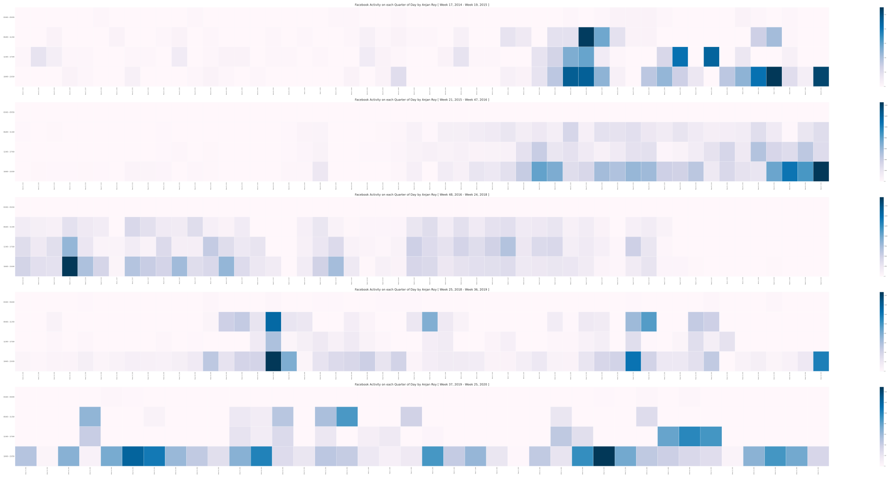

# Facebook Activity on each Quarter of Day

## intro

I was interested in understanding on which quarter of day I'm mostly active on facebook over a long period of time. So I decided to plot a heatmap with all facebook likes, reactions and comments depicting my public facebook activity _( chatting part is not considered here )_ and any changes happened to it over time. 

So I grouped all like, reaction & comment events by their corresponding week of happening, where week is identified in **Week X, Y** form where _X is week number of a year Y_. Under each week I accumulated like, reaction & comment events by their corresponding quarter of day of happening.

I splitted each day _( assuming exactly 24 hr lenthy )_ into four equal parts i.e.

- 00:00 - 05:59
- 06:00 - 11:59
- 12:00 - 17:59
- 18:00 - 23:59

For a week long of time period, all like, reaction & comment events to be accumulated under smaller timeframe of 24 hr length - splitted into 4 parts.

Count of like, reaction & comment event's in each of these quarters to be stored for each of week identifiers. 

## example

We'll finally plot a heatmap with each axis having 52 number of week identifiers along its X-axis. Multiple axes will be present in figure if we're covering longer time span. 

