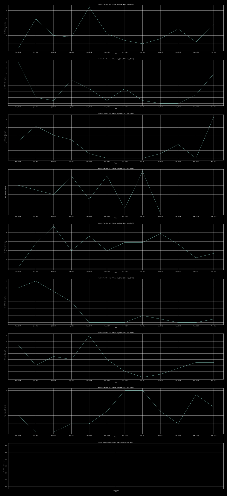

# Monthly Facebook Friends Created by YOU 

## purpose

Given friends data for a facebook user, we'll try to plot a line plot showing monthly friends created over this period of time. Friending rate is said to be 0/month, if in a certain month there's no friend created. 

## example 

Here's an example plot showing friending rate per month of one facebook user over time.

