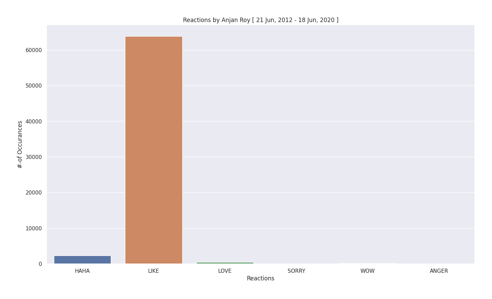

# Facebook Likes & Reactions by You

## purpose

Trying to understand which facebook reactions you're using more over whole timespan. It's a simple bar chart, showing count of each reaction type. 

## example

Here's a sample bar plot for this category.

