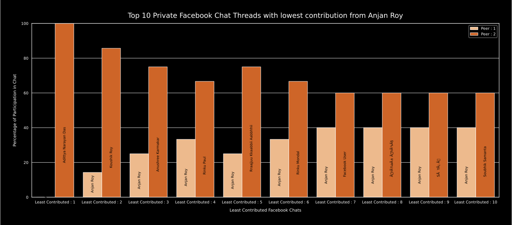

# Top X Private Facebook Chat Threads with lowest contribution from YOU

## intro

First we'll go through all private facebook chat threads and obtain each participant's contribution to chat in terms of #-of messages they sent in this thread. Then we'll sort them descendically in terms of total activeness of chat thread. 

We pick half of those most active chats, if given _X <= .5 * total #-of chat threads_, otherwise we'll pick first X most active chats. On those chat threads, we'll run a simple filtering, where only those X chat threads where YOU have contributed least are picked.

And we've the data, along with cooresponding percentage of contribution. This is to be now plotted as grouped bar chat, to show a comparison of each participant's contribution in chat.

## example

These are chat threads where _this user_ has contributed least.

