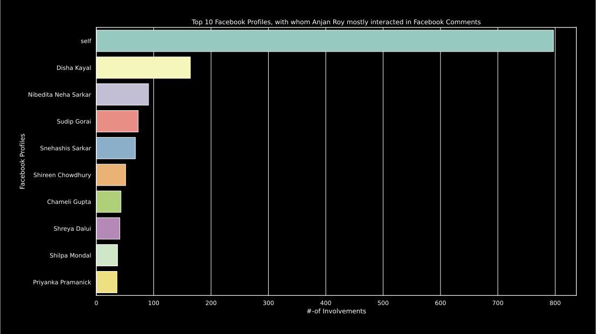

# Top 10 Facebook Profiles, with whom YOU mostly interacted in Facebook Comments

## intro

First we'll extract all _( top X )_ facebook profiles with whom this user mostly interacted in facebook comments. 

Let me be little more clear about _interaction_. If this user has commented on some facebook profile's photos/ posts/ videos etc.; if this user has replied to some comment - all these are considered to be _interaction_.

And after collecting those informations, we'll plot a bar chart with facebook profile names & corresponding involvement count.

**Note: _self_ == YOU, denotes how many times you've interacted with yourself in comments i.e. responding to your own comment/ commenting to your own post.**

## example

