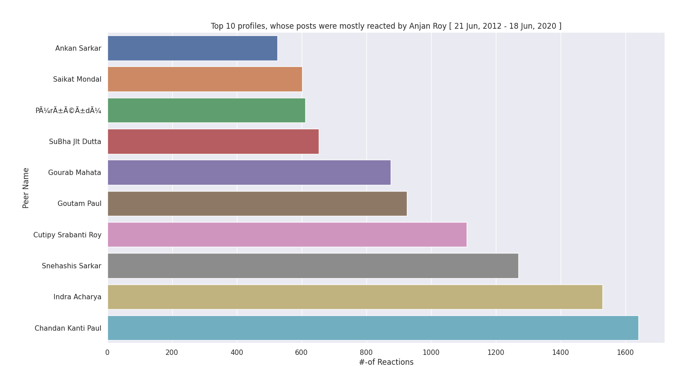

# Top 10 Facebook profiles, whose posts were mostly reacted by You

## purpose

Picks up top _X_ ( here it's 10 ) profiles, whose posts were mostly liked/ reacted by You over this whole time span. It's a simple bar plot depicting same.

## example

Sample bar plot for this category

