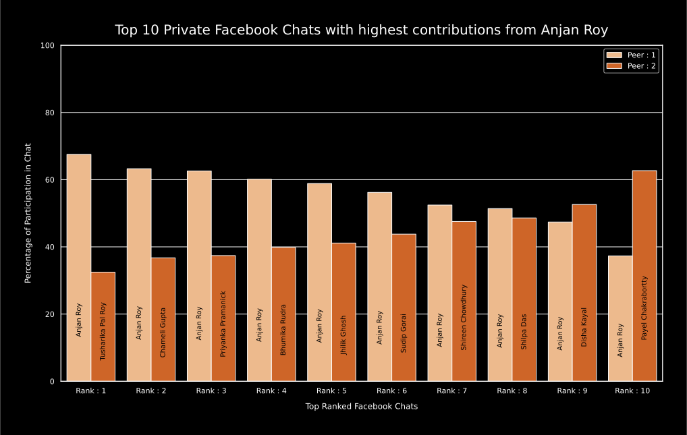

# Top X Private Facebook Chats, where you've contributed most

## intro

For understanding what are those high traffic private chats where I contributed mostly _( more than another participanting peer )_ i.e. showing my interest in chatting with those persons, I plotted a grouped bar plot, where along X-axis private chats are ranked descendingly as per their message count and under each chat group both the participants percentage of contribution is shown. 

## example

Here's a demo grouped bar plot for this category, where X = 10.

