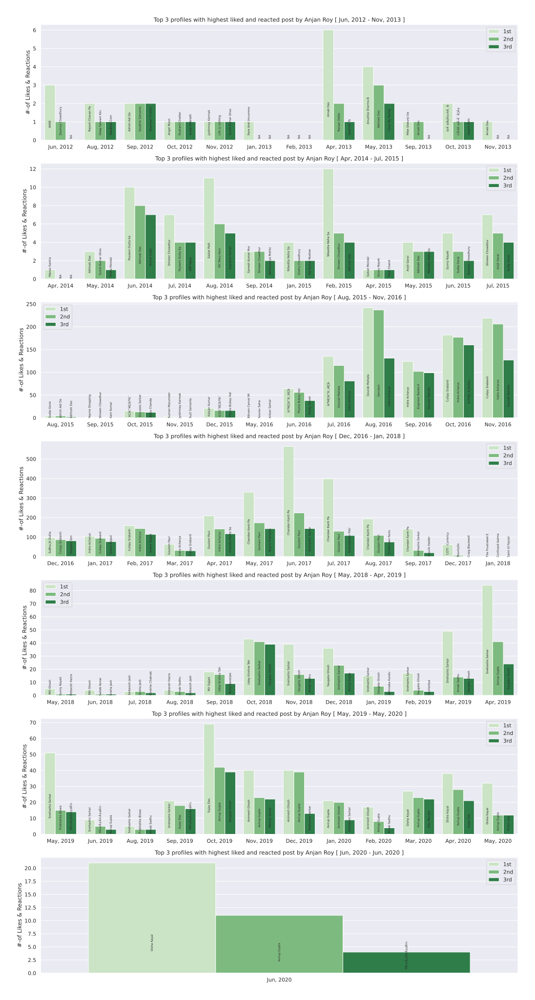

# Top 3 Facebook profiles, whose posts were mostly liked & reacted by YOU, _per month_

## purpose

Here we're interesting in exploring which porfile's posts were mostly liked and reacted by you in each month over whole time frame of this data set. 

This will give us an insight into how top 3 places were changing over time in monthly basis. I've choosen month based analysis due to the fact that this will be helpful in terms of ease of plotting. I'm going to top *3* profiles cause this looked a nice number to me :stuck_out_tongue_winking_eye: 

## example

Top 3 profiles whose posts were liked & reacted mostly by this actor, in monthly basis.

