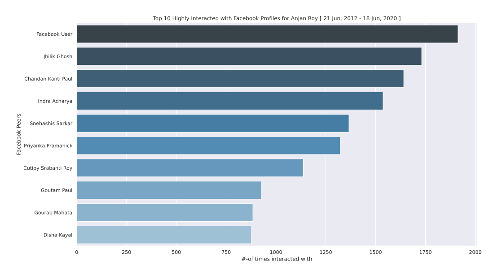

# Top X Facebook Profiles with high interaction with YOU

## intro

This analysis tries to summarise all categories we've visited yet i.e.
_likes & reactions; comments; chat threads_ based individual analysis into a single one. We try to find out mostly interacted with facebook profiles/ pages & plot them in form bar plot along with interaction count for each of them.

## example

