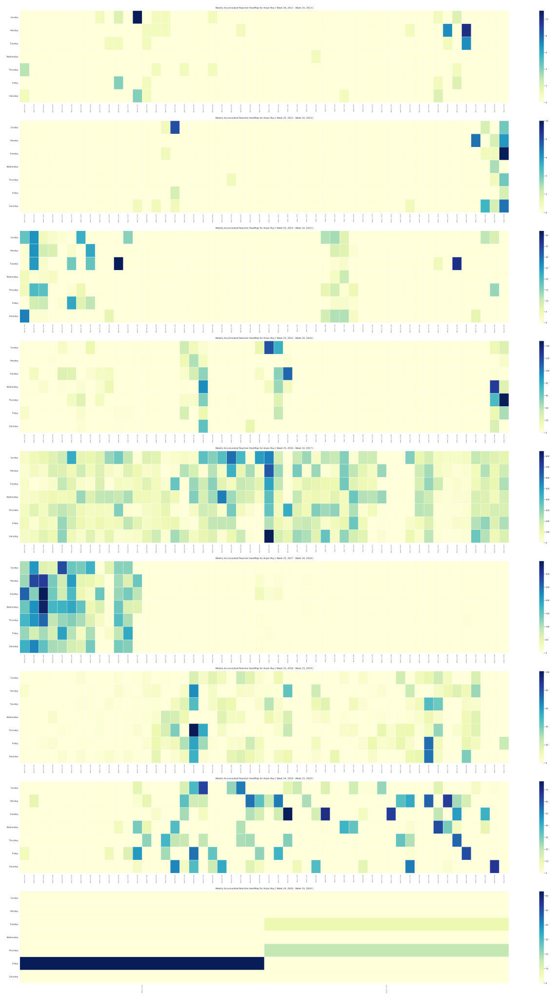

# Weekly Accumulated Facebook Likes & Reactions HeatMap

## purpose 

Given likes and reactions data of a user's facebook account, we'll first group that data by weeks _( in hashmap form )_. And under each week key of that hashmap, we need to keep track of total count of liked & reacted posts for each week day in a certain week. 

Now each week can be uniquely be identified as **Week {x}, {y}**, where _x = week number in a year, starting from 1_ and _y = Year we're in_

This 2D data can be plotted as heatmap to depict user activity on facebook _( in terms of likes and reactions )_ across week days over whole time frame of dataset. 

- Shows on which week day user is mostly active
- Did it change overtime ?
- If yes, how did it change ?
- How many likes and reactions user did on a single day ?
- Is there any trend in their activity ?
- Is user regular on facebook ?
- Did that regularity showing any pattern, on a specific month or specific week that gets repeated etc. 

Along X-axis weeks to be plotted and along Y-axis week day names to be plotted. In each cell of heatmap we'll keep track of how many likes and reactions done by user. 

For keeping some flexibility in plotting, I'm going with _max 52 weeks_ in a subplot. The dataset I'm using for generating example plots, is 8-year time spanned. So, yeah 8-subplots in a single figure. 

I'm going with _*.svg_ as output format of our plot, so that after zooming, plot doesn't get distorted. 

## example

8-years of facebook activity in a single plot.

