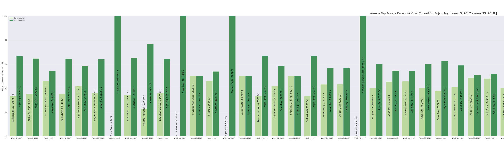
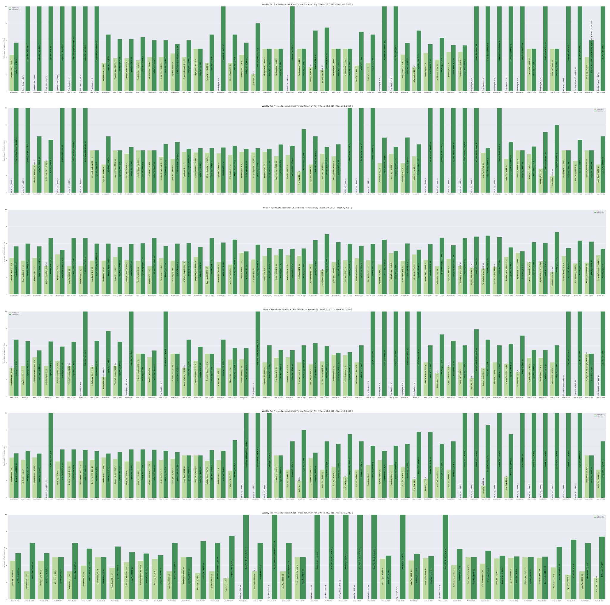

# Weekly Top Private Facebook Chat Thread for YOU

## intro

How about we get to explore which facebook private chat thread was most active on each week of facebook activity. That will get us insight into
    - What is most active chat thread on each week ?
    - Which people did you talk to most ?
    - How long did that go ? 
    - How did that pattern changes over time ? etc. 

So, I grouped all facebook private chat threads into their corresponding week of occurance. And in each week, I found which chat thread was most active, in terms of total messages sent. Then for each participant, their percentage of contribution was calculated, which was plotted as grouped bar chat. 

## example

